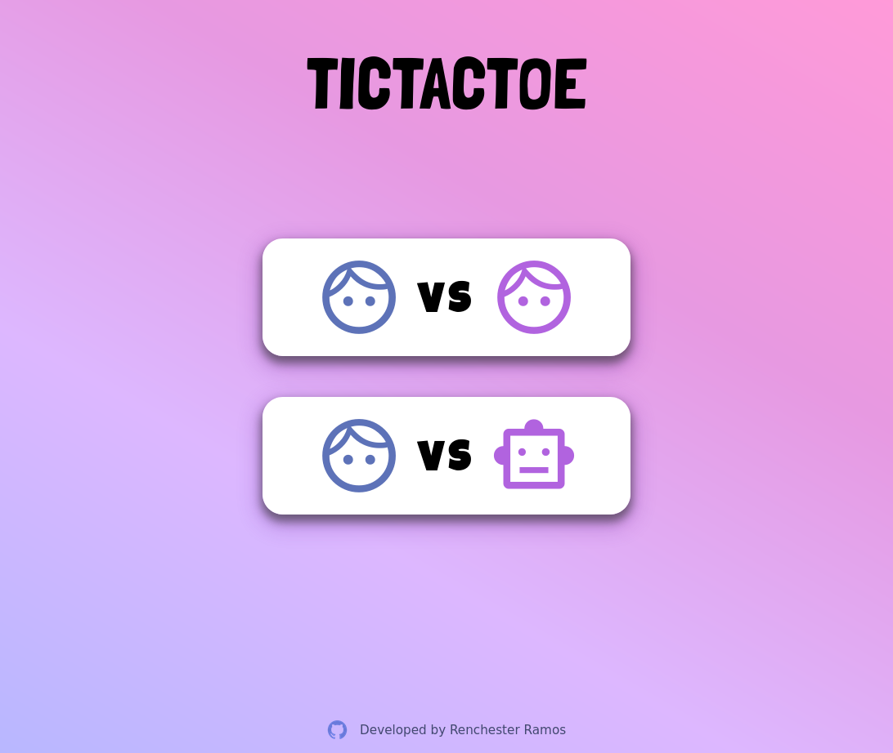
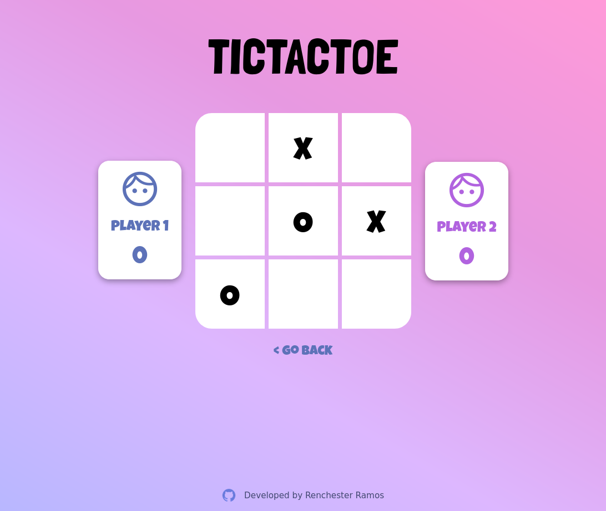

## The Odin Project

# Project: Tic Tac Toe

**Live version** of the game can be found [here](https://renchester.github.io/top-tictactoe/)

This project is a recreation of the classic 1v1 Tic-Tac-Toe game built with HTML, CSS, and vanilla Javascript. The development of this app served as an introduction to factory functions and the Javascript module pattern.

The game has two modes:

1. _Player vs. Player (PvP)_
   Choosing this mode displays an interface that asks for both player's names which will be referenced in the scoresheet and result display.
2. _Player vs. Computer (PvC)_
   This mode allows the user to play against a computer. The [minimax algorithm](https://towardsdatascience.com/how-a-chess-playing-computer-thinks-about-its-next-move-8f028bd0e7b1?gi=aa0f2020509c) is used to generate the computer's moves--ensuring that the AI is impossible to beat.

Both modes are available in the initial screen.

### Code Structure

Both the board state and display controller are stored in their own respective modules, with a player factory function to generate player properties and methods. The board and display modules have private and public methods used to facilitate gameplay. Thanks to the revealing module pattern, the displayed elements of the game interact separately from the actual game state to prevent possible vulnerabilities.

### Display

The app is fully responsive, making use of the `clamp()` CSS feature extensively to fit several screen sizes.

Developed by **Renchester Ramos**
